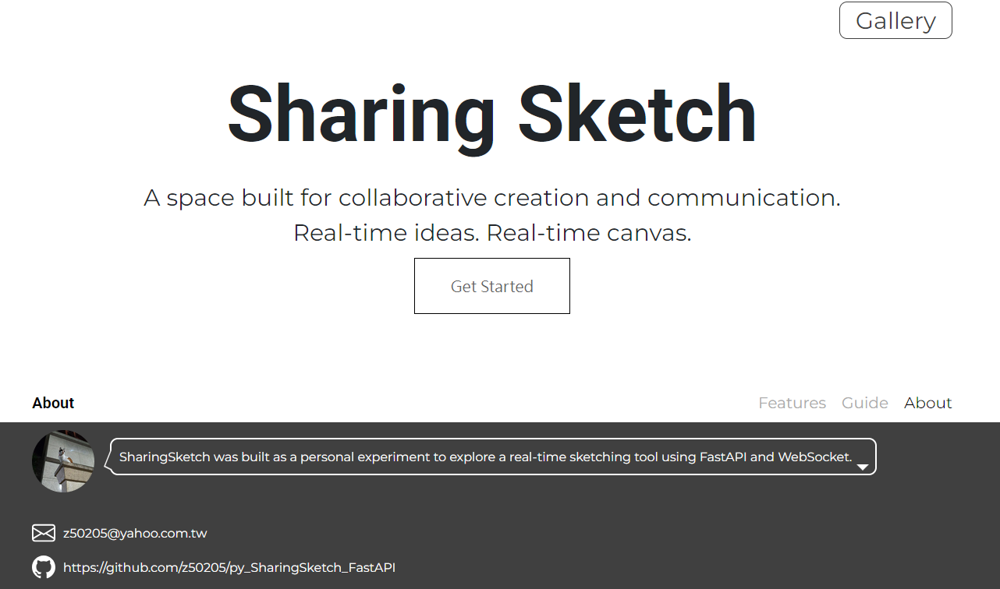
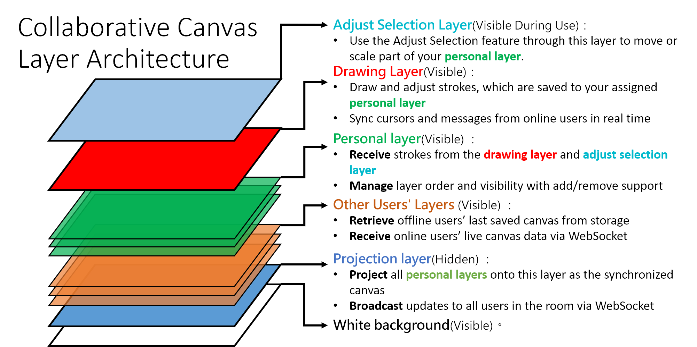

# SharingSketch _- Real-time collaborative cnavas_
- **Demo Site**: https://bizara.link/

  </img>

## Features

---

### Sketch(/room)
- **Synchronization:** Synchronize member canvases, display member cursors and messages, and monitor online status to automatically switch between real-time canvas and saved canvas snapshots.

https://github.com/user-attachments/assets/e1f912ed-0cf4-46d3-8c1f-bf78bb585b7b

- **Paint Tools:** Draw with a pen or an eraser that allows you to adjust color and line width.
- **Canvas Tools:** Provide undo, mirror, and selection adjustment functionalities to enhance drawing efficiency.

https://github.com/user-attachments/assets/ecc1d081-3ece-4499-a591-a90fe5bc58cf

---

- **File Tools:** Save room layers, download canvas image, and export to gallery for publishing and display.

https://github.com/user-attachments/assets/a86bbcc2-758e-4145-a8ea-f1db16a1b7c2

---

- **Layer Tools:** Create individual layers and easily change their order.

https://github.com/user-attachments/assets/a3cd76a2-09ee-4898-991a-17ba86b977dc

---

### Join Room(/chooseroom)

- **Room Access:** Enter a new room or use the room list to enter an existing room.
- **Room Management:** Support room deletion and display status control in the lobby.

https://github.com/user-attachments/assets/40f572ab-64e4-4776-98b9-2d134af4c403

---

### Gallery(/gallery)

- **Display:** Show all publicly available images organized by a tagging system for easy categorization.
- **User Profile Access:** Facilitate navigation to a user’s profile page by selecting the user icon.
- **Pagination:** Display 6 images per page to enhance navigation and performance.

### Portfolio(/portfolio)

- **Image Management:** Support image removal, download, and display status control across the gallery.
- **Profile Management:** Enables avatar uploads and About Me edits for user personalization.
- **Export:** Export image to SharingSketch for further editing.

https://github.com/user-attachments/assets/fa468763-74dc-4d8e-9313-a6e19efe7baf

## Demo Timelapse

https://github.com/user-attachments/assets/8f94d57c-3ad7-4381-8088-dae1fbbbd921

## Tech Stack

- **Sharing Sketch:**
  - **Backend:** FastAPI
  - **Frontend:** Jinja2(HTML,CSS,Bootstrap,JavaScript)
  - **Database:** MySQL
- **Sketch Gallery(Repo [link](https://github.com/z50205/SketchGallery_front.git)):**
  - **Frontend:** React.js
- **Deploy and Environment:**
  - **CI/CD Pipeline:** GitLab CI/CD
  - **Protocols:** WebSocket
  - **Proxy Server:** Nginx
  - **Containerization:** Docker
  - **AWS Cloud Service:** EC2,S3,Route53

## Design Concept

### Architecture Design
- **Nginx Proxy:**  Reverse proxy to hide the specific addresses of backend containers, enhancing security and increasing flexibility.

  </img>

---
### Synchronization Canvas
- **Canvas Stack:** Use a series of WebSocket canvas element to synchronize each users and implement drawing tools.

  </img>

