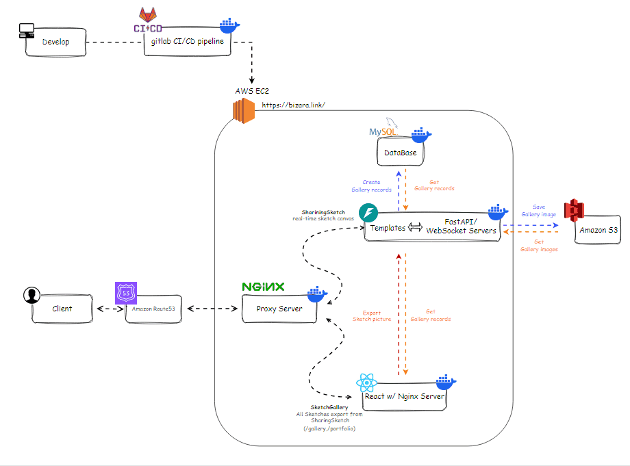

# SharingSketch _- a synchronization drawing tool._
**Sharing Sketch is a real-time synchronization drawing tool, designed to collaborate with users on one canvas.**
- **Demo Site**: https://bizara.link/

  </img>

## Features

### Join Room

- **Join Room:** Enter a new room name and join the room, or use the room list to enter an existing room.

 <video  width="80%" controls>
  <source src="./vids/vid1.mp4" type="video/mp4">
</video> 

---

### Sketch

- **Paint Tools:** Draw with a pen or an eraser that allows you to adjust color and line width.

 <video  width="80%" controls>
  <source src="./vids/vid2.mp4" type="video/mp4">
</video> 

---

- **Canvas Tools:** Provide undo, mirror, and selection adjustment functionalities to enhance drawing efficiency.

 <video  width="80%" controls>
  <source src="./vids/vid3.mp4" type="video/mp4">
</video> 

---

- **File Tools:** Download image or export to SketchGallery for storage, as well as import image from your device to continue drawing.

 <video  width="80%" controls>
  <source src="./vids/vid4.mp4" type="video/mp4">
</video> 

---

- **Layer Tools:** Create individual layers and easily change their order.

 <video  width="80%" controls>
  <source src="./vids/vid5.mp4" type="video/mp4">
</video> 

---

### Gallery

- **Delete:** Delete images if the user is the creator, ensuring proper permissions.
- **Export:** Export image to SharingSketch for further editing.
- **Download:** Download images to your device.
- **Pagination:** Display 6 images per page to enhance navigation and performance.

 <video  width="80%" controls>
  <source src="./vids/vid6.mp4" type="video/mp4">
</video> 

## Tech Stack

- **Sharing Sketch:**
  - **Backend:** FastAPI
  - **Frontend:** Jinja2(HTML,CSS,Bootstrap,JavaScript),WebSocket
  - **Database:** MySQL
- **Sketch Gallery(Repo [link](https://github.com/z50205/SketchGallery_front.git)):**
  - **Frontend:** React.js
- **Deploy and Environment:**
  - **Proxy Server:** Nginx
  - **Containerization:** Docker
  - **AWS Cloud Service:** EC2,S3

## Design Concept

### Architecture Design
- **Nginx Proxy:**  Reverse proxy to hide the specific addresses of backend containers, enhancing security and increasing flexibility.

  </img>

---
### Synchronization Canvas
- **Canvas Stack:** Use a series of WebSocket canvas element to synchronize each users and implement drawing tools.

  </img>

